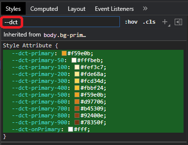

# tailwind-dynamic-color-themes

_... powerful tailwind color themes **(selectable at run-time)**_

TODO: This readme is a placeholder, should I decide to publish this
utility :-)

Developing **dynamic color themes** _that are dynamically selectable
at run-time_ is **a tedious and arduous process**.  Ideally **Dark
Mode** would also be included in our requirements list!  While
**tailwind** provides a powerful foundation to work from, it has no
real support for the dynamics that are needed for this task.

If you are a **tailwind** user _that needs **dynamic color themes**_,
this utility may be just what you are looking for!


<!--- *** Section ************************************************************************* ---> 
**Overview:**

<ul><!--- indentation hack for github - other attempts with style is stripped (be careful with number bullets) ---> 

**tailwind-dynamic-color-themes** _(<mark>aka **DCT**</mark>)_ is a
[tailwindcss] utility that facilitates _**dynamic color themes that
are selectable at run-time**_.

Using **DCT** ...

- You define and use [Context Colors].  These are _abstract colors
  that have meaning in the context of your application_.  You define
  them however you wish _(such as `primary` and `secondary`)_, and
  reference them throughout your markup with **tailwind**'s standard
  color syntax _(ex: `text-primary`, `bg-secondary-400`, etc.)_.

- You then map **Real Colors** to your **Context Colors** through one
  or more [Themes], which can be selected at run-time to **change your
  application colors on the fly!**

- Your colors can be defined either through the **tailwind**'s
  standard color pallet, or your own custom colors _(or a combination
  of both)_.

- It's common to use [Color Shading] to accentuate various
  aspects of your UI.  In **DCT** you can define your own shade
  nomenclature _(e.g. `primaryLight`, `primaryDark`)_, or piggy back
  off of **tailwind**'s numeric shade scale _(e.g. `primary-50`,
  `primary-100`, `primary-200`, etc.)_.

- Speaking of color shades, **DCT** even allows you to [invert your
  color shades] at run-time _(light-to-dark, and dark-to-light)_, **in
  effect doubling the number of color themes available**, and
  potentially supporting an **automatic dark mode theme** _(depending
  on how your colors are implemented)_.
  
- Of course, you can explicitly define your own [Dark Mode] with
  minimal effort _(if [Shade Inversion] doesn't produce the desired
  effect)_ ... it's merely a new theme!  Unlike **tailwind**'s new
  **Dark Mode** feature, using **DCT** to define your **dark themes**
  requires **NO CHANGES** to your markup _(the **tailwind** solution
  requires you to tediously add the `dark` variant throughout your
  markup)_.

- Because **tailwind** needs to know about your Context Colors,
  **DCT** provides a utility that auto-generates the required color
  definitions ... referenced in your `tailwind.config.js` _(part of
  the build process)_.

- As an internal tidbit, the dynamics of run-time color mapping is
  accomplished through the use of CSS Variables _(see [How do it
  know?])_ ... _**inquiring minds want to know!**_

Make sense? ... _that was **Easy Peasy!**_

**DCT** promotes a <mark>**clean and simple approach**</mark> to
 _**dynamic color themes**_ that yields <mark>**powerful
 results**</mark>.

</ul>

<!--- *** Section ************************************************************************* ---> 
## At a Glance

- [Install]
- [Getting Started]
- [Concepts]
  - [Context Colors (Color Abstraction)]
  - [Themes (Real Colors)]
  - [Pulling it all together]
  - [Context Color Shades]
  - [Shade Inversion]
  - [Dark Mode]
  - [Color Systems]
  - [A Note on App State]
  - [A Note on DCT Reactivity]
  - [A Note on ES Modules in Tailwind Configuration]
  - [How do it know?]
- [API]
  - [`initDCT(schema, themes, \[initialThemeName\], \[initialInvertShade\]): DCT`]
  - [`DCT`]:
    - change the active theme:
      - [`activateTheme({\[themeName\], \[invertShade\]}): \[activeThemeName, activeInvertShade\]`]
      - [`activateNextTheme(): activeThemeName`]
      - [`activatePriorTheme(): activeThemeName`]
      - [`toggleInvertShade(): activeInvertShade`]
    - support of theme selection UI control:
      - [`getThemes(): Theme\[\]`]
      - [`getActiveThemeName(): activeThemeName`]
      - [`getActiveInvertShade(): activeInvertShade`]
    - auto configure **tailwind**:
      - [`colorConfig(): TWColors`]
- [Types]
  - [`Schema`]
  - [`Themes`]
  - [`TWColors`]


<!--- *** Section ************************************************************************* ---> 
## Install

- **peerDependencies**:

  **DCT** has a peerDependency on **tailwindcss** _which also needs to
  be configured_.  Most likely you should already have this installed
  ... but just in case:

  ```shell
  npm install --save tailwindcss
  ```

- **the main event**:

  ```shell
  npm install --save tailwind-dynamic-color-themes
  ```


<!--- *** Section ************************************************************************* ---> 
## Getting Started

Out of the starting gate, there are a number of things you must manage
to setup your color themes.  This is not so much a reflection of the
**DCT** utility, but rather the nature of the beast.  **DCT** itself
is easy to use, and _simplifies a number of burdensome details_.

1. **First**: You must determine the [Context Colors] that you will use in
   your application.

   You use **Context Colors** in your markup.  They are abstract
   _(e.g. `primary`/`secondary`)_ in the sense that they have meaning
   in the context of your application.  The **Context Colors** you use
   is completely up to you.  There are a number of philosophies to
   consider in this process, which are discussed in [Context Colors],
   [Color Shading], [Shade Inversion], [Dark Mode], and [Color
   Systems].
   
   The end result of this step will be your **DCT** [`Schema`].  For
   sake of example, let's say we will be using the following **Context
   Colors** _(remember this definition can be whatever you desire)_:
   
   **Our Schema:**
   ```js
   const schema = ['primaryLight',   'primary',   'primaryDark',
                   'secondaryLight', 'secondary', 'secondaryDark',
                   'onLight',
                   'onDark',
                   'accentBorder',
                   'backdrop',
                  ];
   ```

2. **Next**: We need to apply [Real Colors] to the process.  
   
   This is accomplished through [Themes].  You will typically define
   multiple themes _(that are changeable at run-time)_, but starting
   out we can get by with one.  At least one theme is required, else
   our system would have **no color** at all.

   [`Themes`] map **Real Colors** to your **Context Colors** at
   run-time.  It's that simple!  In this example, we use the
   **tailwind** color pallet for our **real colors**.
   
   **Our Initial Theme:**
   ```js
   const themes = {
     'Cool Gray': {
       contextColors: {
         'primaryLight':   'coolGray-300',
         'primary':        'coolGray-500',
         'primaryDark':    'coolGray-900',
         
         'secondaryLight': 'orange-300',
         'secondary':      'orange-500',
         'secondaryDark':  'orange-900',
         
         'onLight':        'black',
         'onDark':         'white',
         
         'accentBorder':   'coolGray-600',
         
         'backdrop':       'coolGray-100',
       },
     },
   };
   ```
   
3. **Next**: We must [pull these two aspects together] and initialize
   our application with color themes.
   
   This is accomplished through the [`initDCT()`] function.  This
   fuses the relationship between our [`Schema`] and [`Themes`], and
   initializes **DCT** making it available for use in the application.

   We place this in a separate module to provide a **"single source of
   truth"**.
   
   **colorTheme.js**
   ```js
   import {initDCT} from 'tailwind-dynamic-color-themes';
   
   const schema = ['primaryLight',   'primary',   'primaryDark',
                   'secondaryLight', 'secondary', 'secondaryDark',
                   'onLight',
                   'onDark',
                   'accentBorder',
                   'backdrop',
                  ];
   
   const themes = {
     'Cool Gray': {
       contextColors: {
         'primaryLight':   'coolGray-300',
         'primary':        'coolGray-500',
         'primaryDark':    'coolGray-900',
         
         'secondaryLight': 'orange-300',
         'secondary':      'orange-500',
         'secondaryDark':  'orange-900',
         
         'onLight':        'black',
         'onDark':         'white',
         
         'accentBorder':   'coolGray-600',
         
         'backdrop':       'coolGray-100',
       },
     },
   };
   
   const DCT = initDCT(schema, themes);
   export default DCT;
   ```

   **Please Note** that our module exports the [`DCT`] object
   _(returned from [`initDCT()`])_.  This object contains the
   remaining **DCT** API, and can be used by other aspects of our
   application.

   Because this module executes [`initDCT()`] in-line _(i.e. in module
   scope)_, the mere act of importing it will initialize our system.
   As a result, this module must be imported very early in our
   application start-up process.
   
   **main.js**
   ```
   import './layout/colorTheme'; // initialize our color themes EARLY in our app's life-cycle
   ... snip snip
   ```
   
4. **Last**: We must define our new [Context Colors] to **tailwind**.
   
   Remember, **tailwind** requires a build process, that is driven from
   `tailwind.config.js`.  Fortunately **DCT** provides a utility function
   you may use to provide this definition.  Because our `colorTheme.js`
   module promotes a **"single source of truth"**, we can be assured that
   **tailwind** has the latest up-to-date information.
   
   **tailwind.config.js**
   ```js
   import DCT from './src/layout/colorTheme';
   export default {
     ... snip snip
     // define our abstract Context Colors
     theme: {
       extend: {
         colors: DCT.colorConfig(),
       },
     },
     ... snip snip
   };
   ```

   **HINT:** Having trouble with this snippet, due to **ES Modules**?
   Please refer to [A Note on ES Modules in Tailwind Configuration].
   
5. **Finally**: You are free to use your **Context Colors** in your markup.
   
   Your **Context Colors** can be used in all the standard **tailwind**
   color directives _(ex: `bg-primaryDark`, `text-onDark`, etc.)_.
   
   At this point, you will want to fully flesh out your system,
   insuring that only your abstract **Context Colors** are used.

6. **Bonus**: [Shade Inversion]

   **DCT** offers a unique feature that allows you to invert the
   shades of your theme at run-time _(light-to-dark, and
   dark-to-light)_.  This has the effect of **doubling the number of
   color themes available**, and potentially supporting an **automatic
   dark mode theme** _(depending on how your colors are implemented)_.

   If your themes are seeded with **tailwind** colors, you can play
   with this option _(only **tailwind** colors support **shade
   inversion** - custom colors simply no-op)_.  Simply **add a UI
   control** _(somewhere in your app)_ that invokes the
   [`DCT.toggleInvertShade()`] function.

7. **Later**: You will want to define multiple color themes.
   
   You can supply additional color themes by simply adding them in your
   [`Themes`] structure.
   
   Once you do this, you will need to provide a UI Control to change the
   active theme.

   For a quick start, **DCT** provides some convenience functions that
   allow you to quickly toggle through all your themes.  These
   utilities are typically used as a dev tool.  Normally your app will
   promote a more sophisticated UI control for this setting.

   **Example** _(in [Svelte])_:
   ```html
   <button on:click={DCT.activateNextTheme}>Next Theme</button>
   <button on:click={DCT.activatePriorTheme}>Prior Theme</button>
   <button on:click={DCT.toggleInvertShade}>Toggle Shade</button>
   ```

   The syntax _(above)_ will vary depending on the front-end framework
   you are using.  The relevant point is: you merely need to invoke
   one of the appropriate [`DCT`] functions.


<!--- *** Section ************************************************************************* ---> 
## Concepts

**tailwind-dynamic-color-themes** _(<mark>aka **DCT**</mark>)_ is a
[tailwindcss] utility that facilitates _**dynamic color themes that
are selectable at run-time**_.

The following sections discuss the basic concepts of **DCT**:

- [Context Colors (Color Abstraction)]
- [Themes (Real Colors)]
- [Pulling it all together]
- [Context Color Shades]
- [Shade Inversion]
- [Dark Mode]
- [Color Systems]
- [A Note on App State]
- [A Note on DCT Reactivity]
- [A Note on ES Modules in Tailwind Configuration]
- [How do it know?]


<!--- *** Section ************************************************************************* ---> 
## Context Colors (Color Abstraction)

<ul><!--- indentation hack for github - other attempts with style is stripped (be careful with number bullets) ---> 

Applications that employ color themes, make use of a set of contextual
colors (i.e. **Context Colors**) that are referenced in the
application's markup.  In other words, they use Context Colors,
**NOT** real colors.

**Context Colors** are abstract.  They have meaning in the context of
your application.  Typically their names don't appear to be color
related at all.  Rather theirs names are derived from the desired
color to use within some app-specific context.  This could be
something as abstract as a "primary" section, or as concrete as an
"error" display.  You are in control of the "contextual" meaning in
your application.  You define them however you wish _(ex: `primary`,
`onPrimary`, `secondary`, `onSecondary`, `error`, `warning`, etc.)_.

In **DCT** your **Context Colors** are first-class **tailwind**
colors, so so you may use the standard color reference notation in
your markup _(ex: `text-primary`, `bg-secondary-400`, etc.)_.

**Context Color** definitions are made through a [`Schema`].  This is
really nothing more than a list of abstract names you will use for
color references in your markup.

As a result, schema definition  is an extremely simple process!
The **hard part** is 
  **a:** determining your context color philosophy _(see [Color Systems] for more insight)_, and
  **b:** permeating these colors throughout your markup _(obviously easier if you are starting from scratch)_.

There is a **big payoff** however, and that is the **ease at which** you can 
  **a:** tweak the colors in your application,
  **b:** support multiple color themes, and
  **c:** add support for dark mode!


**SideBar:** Because **tailwind** needs to know about your **Context
Colors**, **DCT** provides a utility that you will reference in the
color section of your `tailwind.config.js` _(part of the build process
... see: [`DCT.colorConfig()`])_.

</ul>


<!--- *** Section ************************************************************************* ---> 
## Themes (Real Colors)

<ul><!--- indentation hack for github - other attempts with style is stripped (be careful with number bullets) ---> 

[`Themes`] map **Real Colors** to your **Context Colors** at run-time.
It's that simple!

Typically, you will define multiple color themes.  However it is
surprising what you can do with a single theme.  For example, you can
make minor color adjustments throughout your entire application from a
single source (i.e. your theme)!

Never the less, once you have gone through this process, it is a
minimal effort to define multiple themes, so you might as well take
the plunge!

In **DCT** **Real Colors** are supplied through **tailwind**'s
[standard color
pallet](https://tailwindcss.com/docs/customizing-colors#color-palette-reference).
This includes a total of 220 colors _(22 base colors, each with 10
shades)_.

If that is not enough, you can also specify **Real Colors** through
CSS compatible color definitions _(ex: `'#8050c8'`)_.  This however is
discouraged, because you loose the capability to invert shades, and define
opacity _(see [`Themes`] for more detail)_.

</ul>


<!--- *** Section ************************************************************************* ---> 
## Pulling it all together

<ul><!--- indentation hack for github - other attempts with style is stripped (be careful with number bullets) ---> 

Your [Context Colors] _(i.e. [`Schema`])_ and [Real Colors]
_(i.e. [`Themes`])_ are closely related within your application.  Each
theme maps real colors to your context colors.

The fusion of this relationship is accomplished through the
[`initDCT()`] function, which accepts both `schema` and `themes`
parameters, providing a central place where these two aspects
can be affirmed and validated.

Interestingly enough, this is the only public function promoted by
**DCT**.  It however returns a [`DCT`] object which in turn promotes
the remaining API.  The reason for this is to fuse the relationship
between the `schema` and `themes`.  The `DCT` object contains
functions to:

- change the active theme at run-time ... see:
  [`DCT.activateTheme()`], 
  [`DCT.activateNextTheme()`],
  [`DCT.activatePriorTheme()`],
  [`DCT.toggleInvertShade()`]

- miscellaneous API in support of the app's theme selection UI
  control ... see:
  [`DCT.getThemes()`],
  [`DCT.getActiveThemeName()`],
  [`DCT.getActiveInvertShade()`]

- auto configure the **tailwind** context colors in
  `tailwind.config.js` _(part of the build process)_ ... see:
  [`DCT.colorConfig()`]

</ul>


<!--- *** Section ************************************************************************* ---> 
## Context Color Shades

<ul><!--- indentation hack for github - other attempts with style is stripped (be careful with number bullets) ---> 

Color shades are typically an important part of your color definition,
helping to distinguish various aspects of your UI.  As an example, you
may need three distinct shades for your primary context color:
`primaryLight`, `primary`, and `primaryDark`.

In **DCT** you have a choice when defining your context color shades:

- you can define your own shade nomenclature _(e.g. `primaryLight`,
  `primary`, `primaryDark`)_

- or you can use **tailwind**'s numeric shade scale
  _(e.g. `primary-50`, `primary-100`, `primary-200`, etc.)_

The former provides a more distinct set of color shades, and is
accomplished through a [`Schema`] definition of a single context
color.  In turn, your [`Theme`] can seed this with either a
**tailwind** color shade _(e.g. `'gray-100'`)_, or a custom color
_(e.g. `'#E4E4E7'`)_.

The latter provides more automated shades, and is accomplished through
a [`Schema`] definition of a multi-shaded context color.  In this case
your [`Theme`] **must** seed this with a **tailwind** color that is
_shadable_ _(e.g. `'gray'`)_.

As it turns out, the set of context colors you use may represent a
mixture of both approaches.

**Note on [Shade Inversion]**: 

<ul>

Regardless of which option you use, you may still invert the shades of
either approach, providing the [`Theme`] is seeding this with
**tailwind** colors.  In other words, custom colors cannot be shade
inverted.

</ul>

**Best Practice**: Use single context colors with your own shade
nomenclature

<ul>

By using your own shade nomenclature, it:

- represents a more distinct set of shades _that is easier to
  remember and adhere to_

- provides the ability to more finely tune the color shades in-use
  _(by your [`Theme`])_ for different base colors
  _(for example, your `'Emerald'` theme may require a slightly darker
  `primaryLight` than other themes)_

</ul>


**Best Practice**: Avoid using **tailwind**'s numeric shade scales to
distinguish context color boundaries.

<ul>

You may be tempted to define a single context color _(say `base`)_
using **tailwind's** multi-shaded numeric scale _(`base-100`, etc.)_,
and then distinguish multiple context color boundaries with this one
definition _(example: `base-100` is **primary** and `base-700` is
**secondary**)_.

This may sound like a good idea initially, however it is simply too
confusing.  A heuristic like this hides the underlying real intent,
and is hard to remember.

It also doesn't allow color distinctions between your context
boundaries ... rather your context distinctions are restricted to
shades of the same color.

Most importantly, you cannot change this heuristic without changing
all of the markup in your entire application.

</ul>


<!--- *** Section ************************************************************************* ---> 
## Shade Inversion

<ul><!--- indentation hack for github - other attempts with style is stripped (be careful with number bullets) ---> 

A unique feature of **DCT** is the ability to invert your color shades
at run-time.

When you do this your light shades become dark and your dark shades
become light.  This has the effect of doubling the number of available
color themes.

You can choose to use this feature or simply let sleeping dogs lie
_(i.e. leave it alone)_.

Shade inversion is accomplished at run-time, when the active theme is
specified _(either through [`DCT.activateTheme()`] or
[`DCT.toggleInvertShade()`])_.

The interesting aspect of this feature is it has the potential of
supporting an **automated dark mode**, depending on how your color
philosophy is implemented.

**Please Note** that only **tailwind** colors support **shade inversion**.  Custom
colors will simply no-op on **shade inversion** requests.

</ul>


<!--- *** Section ************************************************************************* ---> 
## Dark Mode

<ul><!--- indentation hack for github - other attempts with style is stripped (be careful with number bullets) ---> 

As we have discussed, it is possible to automatically glean a **Dark
Mode** by using **DCT**'s [Shade Inversion] feature.  It really
depends on how your color scheme is implemented.

If your color philosophy produces dark modes by simply inverting the
color shades, you are [in like flynn]!  Simply alias the **DCT**
inversion state to a dark mode and you are done!

As a fallback, if this doesn't work _(for whatever reason)_, don't
fret ... dark modes are easily achieved!

Dark modes are extremely simple to implement in **DCT**!  You simply
define a theme that adjusts your colors to a dark color strategy.
It's really no different than defining themes with distinct base
colors.

Unlike **tailwind**'s **Dark Mode** feature, in **DCT** there are
**NO** changes to your markup, because you have abstracted this away
by using [Context Colors].

This is in stark contrast to **tailwind**'s **Dark Mode** feature,
which requires you to tediously add the `dark` variant throughout your
markup!

</ul>


<!--- *** Section ************************************************************************* ---> 
## Color Systems

<ul><!--- indentation hack for github - other attempts with style is stripped (be careful with number bullets) ---> 

In consideration of defining your application's [Context Colors],
there are a number of **Color System** design philosophies that
provide insight on this topic.

This is a rather large topic.  You can choose to follow one of these
designs, or simply derive your own.  Regardless, it is worth a quick
review, to get a better feel for some of the concepts.

<!--- ARTICLE NOT REFERENCED:
Designing Systematic Colors <<< PROB NOT REFERENCE
... https://uxplanet.org/designing-systematic-colors-b5d2605b15c
 ---> 

I do not claim to be an expert on this topic.  However a quick web
search reveals a few **Color Systems**:

- [Material]
- [IBM]
- [Open Color]

<!--- Material General Desc: https://material.io/archive/guidelines/style/color.html#color-color-system ---> 

I am most familiar with Material, where they define:

- Primary Color:
      
  A primary color is the color displayed most frequently across your
  app’s screens and components. It can also be used to accent
  elements, if you don’t have a secondary color.
  
  To create contrast between elements, you can use lighter or darker
  tones of your primary color. The contrast between lighter and darker
  tones helps show division between surfaces, such as between the
  status bar and a toolbar.
  
- Secondary Color
  
  A secondary color is used to accent select parts of your UI. It can
  be complementary or analogous to your primary color, but it should
  not simply be a light or dark variation of your primary color. It
  should contrast with elements that surround it and be applied
  sparingly as an accent.
  
  Secondary colors are best used for:
  
  - Buttons, floating action buttons, and button text
  - Text fields, cursors, and text selection
  - Progress bars
  - Selection controls, buttons, and sliders
  - Links
  - Headlines
  
  Using a secondary color is optional. It’s not necessary if you use
  variations of your primary color to accent elements.

**Color Tools**

<!--- Material UI Playground: https://material-ui.com/customization/color/#official-color-tool ---> 
<!--- Material IO Playground: https://material.io/resources/color ---> 

You can find find a number of interactive tools that will assist you
in getting started.  This will help define the [Context Color]
structure you wish to use.

As an example, the [Material IO Color Config Tool] is a sandbox
playground that allows you to interact with various colors and see how
they look in various scenarios.  Once you are happy with your color
selection, you can simply translate your chosen colors to "close"
colors in the **tailwind** color pallet.

**Accent Colors**

Ever wondered how designers find the perfect color combinations?  Well
there is a formula for that!  It uses a color wheel invented by Isaac
Newton in 1666!

There are several color combinations that you can use, to ensure your
colors are in harmony ... read all about it here: [Color theory and
the color wheel].

You can use a [Color Calculator] to assist in the process.  Simply
seed it with one of **tailwind**'s base colors, calculate your accent
color, and translate it back to a "close" **tailwind** color ...
**Easy Peasy**!

</ul>


<!--- *** Section ************************************************************************* ---> 
## A Note on App State

<ul><!--- indentation hack for github - other attempts with style is stripped (be careful with number bullets) ---> 

**DCT** introduces one piece of state in your application ... that is
the [`DCT`] object.  How you manage this state is up to the
requirements of your application.

- If your application runs exclusively on the browser, then you should
  be able to get by with a module-scoped state solution.  This is
  simple to accomplish and is what you will see in the examples of
  this documentation.

- If your application can run on a server _(in addition to the browser
  ... say via Server Side Rendering)_, then you will need to manage
  this state appropriately.  This is outside the scope of this
  document, and may vary based on the web framework you are using.

</ul>


<!--- *** Section ************************************************************************* ---> 
## A Note on DCT Reactivity

<ul><!--- indentation hack for github - other attempts with style is stripped (be careful with number bullets) ---> 

The [`DCT`] object represents an additional piece of application state, of
which **certain aspects can change**.  It contains four pieces of state:

- Two are non-changing static resources:
  * the [`Schema`]
  * the [`Themes`]
- Two are dynamic resources that can change:
  * the `activeThemeName`
  * the `activeInvertShade` indicator

In spite of the fact that the last two resources can change, **DCT**
provides **no means** by which this reactivity can be tracked
... _other than the app module which stimulated it's change_.

The reason for this is simple: There is only **one place** where this
state is needed and used ... that is the **app's UI component that manages Theme
Selection**.  This is assumed to be true in an overwhelming majority of
cases.  The **unique thing** about this fact is that **this component controls
both the display and update** of this state.  As a result it **can easily
manage the reactivity, _because it knows when it changes_**.

Consequently, **DCT** uses the [KISS Principle] so as not to
complicate matters.

If your application is an exception to this rule, you can easily wrap
[`DCT`] in the state management solution of your choosing to promote
it's reactivity.

**FUTURE**: Provide reactivity through simple event (doesn't complicate API at all)!
```
TODO: - We can easily provide reactivity by simply emitting a custom
        DOM event on the <body>: dctThemeChanged - containing:
        activeThemeName/activeInvertShade

      - reword this section

      - document event
        * raw event type
        * reflect in  any function that changes our dynamic state
```

</ul>


<!--- *** Section ************************************************************************* ---> 
## A Note on ES Modules in Tailwind Configuration

<ul><!--- indentation hack for github - other attempts with style is stripped (be careful with number bullets) ---> 

The [`DCT.colorConfig()`] function conveys the **Context Colors** to
tailwind by referencing it directly in the `tailwind.config.js`.  This
is a nice feature because it provides a **"single source of truth"**.

There is an **issue** however, in that by accessing the `DCT` object
in `tailwind.config.js`, we are importing application code _(in the
configuration)_.  Typically our application code contains **ES
Modules**.  Currently, tailwind does NOT support ES Modules in it's
configuration.

You can work around this by resolving the `tailwind.config.js` in your
controlling configuration _(e.g. the configuration file for webpack or
rollup, etc.)_ ... as follows:

```js
rollup.config.js
================
import tailwindcss    from 'tailwindcss';          // NEW: in support of ES Modules
import tailwindConfig from './tailwind.config.js'; //      (found in tailwind.config.js)
... snip snip
export default {
  ... snip snip
  plugins: [
    svelte({
      ... snip snip
      preprocess: sveltePreprocess({
        ... snip snip
        postcss: {
          plugins: [
            ... snip snip
         // require("tailwindcss"),      // ... OLD: normal usage
            tailwindcss(tailwindConfig), // ... NEW: in support of ES Modules (in tailwind.config.js)
```

</ul>


<!--- *** Section ************************************************************************* ---> 
## How do it know?

<ul><!--- indentation hack for github - other attempts with style is stripped (be careful with number bullets) ---> 

Ever heard the joke about the thermos keeping **"hot things hot"**,
and **"cold thing cold"?** The confused bystander asked: **"How do it
know?"**

You may be wondering how **DCT** implements the dynamic color mapping
of **real colors** to **context colors?**

_While this is an internal implementation detail_, the simple answer is:
**CSS Variables** _([CSS Custom Properties])_.

- All tailwind context colors reference **CSS Variables**, for example:

  ```js
  tailwind.config.js
  ==================
    ... snip snip
    colors: { // ... OUTPUT from: dct.colorConfig()
      primary:  "var(--dct-primary)",
      ... snip snip
    }
  ```

- When you change your theme _(at run-time)_ these **CSS Variables** are set
  in the `<body>` tag _(sourced from the theme's real color)_:

  ```html
  <body style="--dct-primary: #B91C1C;">
  ```

You can actually see this in your browser's dev tools.  Simple filter
the Styles section with "--dct" _(the prefix used for all **DCT** CSS
Variables)_:

<p align="center"></p>

If you change your theme, you will see these colors change.

</ul>


<!--- *** Section ************************************************************************* ---> 
## API

The **tailwind-dynamic-color-themes** API is promoted through a [`DCT`]
object _(returned from [`initDCT()`])_.

- [`initDCT(schema, themes, \[initialThemeName\], \[initialInvertShade\]): DCT`]
- [`DCT`]:
  - change the active theme:
    - [`activateTheme({\[themeName\], \[invertShade\]}): \[activeThemeName, activeInvertShade\]`]
    - [`activateNextTheme(): activeThemeName`]
    - [`activatePriorTheme(): activeThemeName`]
    - [`toggleInvertShade(): activeInvertShade`]
  - support of theme selection UI control:
    - [`getThemes(): Theme\[\]`]
    - [`getActiveThemeName(): activeThemeName`]
    - [`getActiveInvertShade(): activeInvertShade`]
  - auto configure **tailwind**:
    - [`colorConfig(): TWColors`]


<!--- *** Section ************************************************************************* ---> 
## `initDCT()`

<ul><!--- indentation hack for github - other attempts with style is stripped (be careful with number bullets) ---> 

The `initDCT()` function is the entry point into **DCT**.  It
initializes the utility for use in your application, and must be
invoked very early in the application startup lifecycle _(typically in
a module scoped context)_.

Once the application has fully loaded _(via the `window load` event)_,
the `initialThemeName`/`initialInvertShade` will be activated
automatically.  This allows the application to manage this `initial`
state _(for example in the browser's local storage)_.

In essence `initDCT()` is an object creator.  It returns the [`DCT`]
object, from which from which all remaining **DCT** API is promoted.
This is done so as to fuse the relationship between the `schema` and
`themes`.  The `DCT` object contains functions to:

- change the active theme at run-time ... see:
  [`DCT.activateTheme()`], 
  [`DCT.activateNextTheme()`],
  [`DCT.activatePriorTheme()`],
  [`DCT.toggleInvertShade()`]

- miscellaneous API in support of the app's theme selection UI
  control ... see:
  [`DCT.getThemes()`],
  [`DCT.getActiveThemeName()`],
  [`DCT.getActiveInvertShade()`]

- auto configure the **tailwind** context colors in
  `tailwind.config.js` _(part of the build process)_ ... see:
  [`DCT.colorConfig()`]

**NOTE**: These [`DCT`] methods are in reality functions _(not
methods)_.  In other words, they can be used without dereferencing the
object at run-time.  The object wrapper (in this case) is simply a
delivery mechanism.

**NOTE**: For additional considerations regarding the [`DCT`] object,
please refer to the discussions on [App State] and [DCT Reactivity].


**API:**

```js
+ initDCT(schema, themes, [initialThemeName], [initialInvertShade]): DCT
```

**Parameters:**

- **`schema`**: {[`Schema`]} - the app-specific color schema, defining
  all [Context Colors].

- **`themes`**: {[`Themes`]} - the structure defining one or more
  named color themes supported by this application.  This applies real
  colors to the context colors specified in the app's [`Schema`].

- **`initialThemeName`**: {string} - the initial `themeName` to use at
  app startup.

  **DEFAULT**: The first theme in the `themes` reference.

- **`initialInvertShade`**: {boolean} - the initial `invertShade`
  option to use at app startup.

  **DEFAULT**: `false`

**Return:** {[`DCT`]} - a `DCT` object, from which
from which all remaining **DCT** API is promoted.

</ul>


<!--- *** Section ************************************************************************* ---> 
## `DCT`

<ul><!--- indentation hack for github - other attempts with style is stripped (be careful with number bullets) ---> 

The **DCT** object _(returned from [`initDCT()`])_ fuses the
relationship between the [`Schema`] and [`Themes`], and promotes the
following API:

**DCT API:**

- change the active theme at run-time:
  - [`activateTheme({\[themeName\], \[invertShade\]}): \[activeThemeName, activeInvertShade\]`]
  - [`activateNextTheme(): activeThemeName`]
  - [`activatePriorTheme(): activeThemeName`]
  - [`toggleInvertShade(): activeInvertShade`]
- miscellaneous API in support of the app's theme selection UI
  control
  - [`getThemes(): Theme\[\]`]
  - [`getActiveThemeName(): activeThemeName`]
  - [`getActiveInvertShade(): activeInvertShade`]
- auto configure the **tailwind** context colors in
  `tailwind.config.js` _(part of the build process)_:
  - [`colorConfig(): TWColors`]

**NOTE**: These **DCT** methods are in reality functions _(not
methods)_.  In other words, they can be used without dereferencing the
object at run-time.  The object wrapper (in this case) is simply a
delivery mechanism.

**NOTE**: For additional considerations regarding the [`DCT`] object,
please refer to the discussions on [App State] and [DCT Reactivity].


</ul>


<!--- *** Section ************************************************************************* ---> 
## `DCT.activateTheme()`

<ul><!--- indentation hack for github - other attempts with style is stripped (be careful with number bullets) ---> 

`activateTheme()` activates the supplied theme, applying it's colors
within the application.

Internally, this merely sets the context-based CSS Variables to the
real colors defined by the theme.

**API:**

```js
DCT: {
  + activateTheme({[themeName], [invertShade]}): [activeThemeName, activeInvertShade]
}
```

**Parameters** _(**Please Note** this function uses named parameters)_:

- **`themeName`**: {string} - the theme name to activate (as defined
  in the [`Themes`] structure).

  **DEFAULT**: the currently active `themeName`.

- **`invertShade`**: {boolean} - an indicator as to whether the
  theme's shaded colors should be inverted (`true`) or not (`false`)
  ...  _i.e. light-to-dark, and dark-to-light_.

  **DEFAULT**: the current `invertShade` setting

**Return:** `[activeThemeName, activeInvertShade]` - the newly activated theme state.

</ul>


<!--- *** Section ************************************************************************* ---> 
## `DCT.activateNextTheme()`

<ul><!--- indentation hack for github - other attempts with style is stripped (be careful with number bullets) ---> 

`activateNextTheme()` advances the current theme to the next one "in
line" _(wrapping at the end)_.  These heuristics are defined by the
**DCT** object, with the same "theme order" as defined in it's
[`Themes`] reference.

This utility is typically used as a dev tool, however it can be used
in production _(if you wish)_.  Normally your app promotes a more
sophisticated UI control for theme selection.

**API:**

```js
+ activateNextTheme(): activeThemeName
```

**Parameters:** NONE

**Return:** activeThemeName - the newly activated themeName

</ul>


<!--- *** Section ************************************************************************* ---> 
## `DCT.activatePriorTheme()`

<ul><!--- indentation hack for github - other attempts with style is stripped (be careful with number bullets) ---> 

`activatePriorTheme()` advances the current theme to the prior one "in
line" _(wrapping at the start)_.  These heuristics are defined by the
**DCT** object, with the same "theme order" as defined in it's
[`Themes`] reference.

This utility is typically used as a dev tool, however it can be used
in production _(if you wish)_.  Normally your app promotes a more
sophisticated UI control for theme selection.

**API:**

```js
+ activatePriorTheme(): activeThemeName
```

**Parameters:** NONE

**Return:** activeThemeName - the newly activated themeName

</ul>


<!--- *** Section ************************************************************************* ---> 
## `DCT.toggleInvertShade()`

<ul><!--- indentation hack for github - other attempts with style is stripped (be careful with number bullets) ---> 

This function toggles the `invertShade` state of the active theme
_(as defined by the **DCT** object)_.

This utility is typically used as a dev tool, however it can be used
in production _(if you wish)_.  Normally your app promotes a more
sophisticated UI control for this setting.

**API:**

```js
+ toggleInvertShade(): activeInvertShade
```

**Parameters:** NONE

**Return:** activeInvertShade - the newly activated invertShade

</ul>


<!--- *** Section ************************************************************************* ---> 
## `DCT.getThemes()`

<ul><!--- indentation hack for github - other attempts with style is stripped (be careful with number bullets) ---> 

Return an iteratable array of all themes in the **DCT** object.  This
is provided as a convenience, because it is typically needed by the
App's theme selection UI control.

**API:**

```js
+ getThemes(): Theme[]
```

**Parameters:** NONE

**Return:** [`Theme`]\[\] ... an array wrapper around the "named" theme
sub-structure of the [`Themes`] object, **with the injection of a
`themeName` property**.

</ul>


<!--- *** Section ************************************************************************* ---> 
## `DCT.getActiveThemeName()`

<ul><!--- indentation hack for github - other attempts with style is stripped (be careful with number bullets) ---> 

Return the `themeName` of the currently active theme.  This is
provided as a convenience, because it is typically needed by the App's
theme selection UI control.

**Note:** The return value of this method represents a dynamic
resource that can change.  Please refer to the discussion on [DCT
Reactivity].


**API:**

```js
+ getActiveThemeName(): activeThemeName
```

**Parameters:** NONE

**Return:** string ... the `activeThemeName`

</ul>


<!--- *** Section ************************************************************************* ---> 
## `DCT.getActiveInvertShade()`

<ul><!--- indentation hack for github - other attempts with style is stripped (be careful with number bullets) ---> 

Return the active `invertShade` setting.  This is provided as a
convenience, because it is typically needed by the App's theme
selection UI control.

**Note:** The return value of this method represents a dynamic
resource that can change.  Please refer to the discussion on [DCT
Reactivity].

**API:**

```js
+ getActiveInvertShade(): activeInvertShade
```

**Parameters:** NONE

**Return:** boolean ... the `activeInvertShade`.

</ul>


<!--- *** Section ************************************************************************* ---> 
## `DCT.colorConfig()`

<ul><!--- indentation hack for github - other attempts with style is stripped (be careful with number bullets) ---> 

The `colorConfig()` function is to be be used in the
`tailwind.config.js` color section _(as part of the build process)_.
It generates a configuration structure that defines the context colors
in-use, as defined by the [`Schema`] contained in the [`DCT`] object.

These color definitions reference CSS Variables that are dynamically
maintained _(at run-time)_ by the active theme.

**API:**

```js
DCT: {
  + colorConfig(): TWColors
}
```

**Parameters:** NONE

**Return:** {[`TWColors`]} - a **tailwind** JSON color structure to be
referenced in the `tailwind.config.js` color section.

**Usage:**
```js
tailwind.config.js
==================
import DCT from './src/layout/colorTheme';
export default {
  ... snip snip
  theme: {
    ... snip snip
    extend: {
      colors: DCT.colorConfig(), // define the context colors in-use
    },
  },
};
```

**NOTE:** Having trouble with this snippet, due to **ES Modules**?
Please refer to [A Note on ES Modules in Tailwind Configuration].

</ul>


<!--- *** Section ************************************************************************* ---> 
## Types

**DCT** promote the following types:

- [`Schema`]
- [`Themes`]
- [`TWColors`]


<!--- *** Section ************************************************************************* ---> 
## `Schema`

<ul><!--- indentation hack for github - other attempts with style is stripped (be careful with number bullets) ---> 

A `Schema` defines the [Context Colors] that are used in your
application (i.e. referenced in your markup).  A `Schema` is one of
two essential parameters supplied to [`initDCT()`] _(the
other is [`Themes`])_.

To fully understand this topic, please refer to discussions on
[Context Colors] and [Context Color Shades].

**Structure:**

In it's simplest form, a `Schema` is merely an array of context color
names.

```js
['primaryLight', 'primary', 'primaryDark', 'secondary', 'onLight', 'onDark']
```

This example specifies six single context colors that can be used in
your application.  

- As a result, your markup may reference colors such as:
  `bg-primaryDark`, `text-onDark`, etc.

- **NOTE:** your [`Theme`] may seed these colors with either a
  **tailwind** color shade _(e.g. `'gray-100'`)_, or a custom color
  _(e.g. `'#E4E4E7'`)_.


> **tailwind's numeric shade scale**:
> 
> If you wish to use **tailwind**'s numeric shade scale in your context
> color, simply wrap the schema's color string in an "inner" array (a
> single element array):
> 
> ```js
> ['primaryLight', 'primary', 'primaryDark', 'secondary', 'onLight', 'onDark', ['error']]
> ```
> 
> This example adds an `error` context color which automatically uses
> the **tailwind** numeric shade scale.
> 
> - As a result your markup can specify _(for example)_ `bg-error` or
>   `bg-error-400` _(**NOTE:** the `error` color reference defaults to the `500`
>   shade)_.
> 
> - **NOTE:** your [`Theme`] must **must** seed this `error` color with a
>   **tailwind** color that is _shadable_ _(e.g. `'red'`)_.

**Note on Shade Inversion**: 

<ul>

Regardless of whether you use **tailwind**'s numeric shade scale _or
not_, you may still invert the shades of either approach, providing
the [`Theme`] is seeding this with **tailwind** colors.  In other
words, custom colors cannot be shade inverted.

</ul>

For more information and **Best Practices**, please refer to the
discussions on [Context Colors] and [Context Color Shades].

</ul>


<!--- *** Section ************************************************************************* ---> 
## `Themes`

<ul><!--- indentation hack for github - other attempts with style is stripped (be careful with number bullets) ---> 

`Themes` is a JSON structure that promotes the various color themes
defined in an application.  It applies real colors to the context
colors specified in the app's [`Schema`].  It defines one or more
"named" themes through it's sub-structure _(one for each theme)_.

`Themes` represent the second essential parameter supplied to
[`initDCT()`] _(the other is [`Schema`])_.

**Structure Example:**

```js
// using the following Schema:
Schema: ['primaryLight', 'primary', 'primaryDark', 'secondary', 'onLight', 'onDark', ['error']]

Themes: {
  'Emerald': {
    `clientProps`: `clientValues`,
    contextColors: {
      'primaryLight': 'emerald-300',
      'primary':      'emerald-500',
      'primaryDark':  'emerald-900',
      'secondary':    'red-500',
      'onLight':      'black',
      'onDark':       'white',
      'error':        'red',
    },
  },
  'Amber': {
    `clientProps`: `clientValues`,
    contextColors: {
      'primaryLight': 'amber-300',
      'primary':      'amber-500',
      'primaryDark':  'amber-900',
      'secondary':    'indigo-500',
      'onLight':      'black',
      'onDark':       'white',
      'error':        'red',
    },
  },
  ... more - snip snip
};
```

- Each "named" theme is defined through a sub-structure, keyed by the
  `themeName` which is referenced in [`DCT.activateTheme()`].  The
  example above has two `themeNames`: `Emerald` and `Amber`.

- The sub-structure contains the following fields:

  * Each theme may contain any number of `clientProps` which is
    totally defined/used by the client application.  As an example, you may
    wish to promote a `desc` in your theme selection UI control.

  * Each theme **must define** the `contextColors` property, which is
    a structure that maps all the [Context Colors] _(of the
    [`Schema`])_ to `realColors`.

    - ALL [Context Colors] _(defined in the [`Schema`])_ **must be
      supplied**.

    - The `realColor` can be on of the following:

      * A **tailwind** color name (found in the `'tailwindcss/colors'`
        import).  This represents a given color with **all it's
        numeric shades**.  This is the **only option** for
        schema-defined **shaded context colors** (because **tailwind**
        is the only supported source for **shaded colors**).

        EX: `'red'`

      * A **tailwind** color name suffixed with a shade.  This
        represents a single color, and can be used for a
        schema-defined **non-shaded context color**.

        EX: `'emerald-900'`

      * A custom color as represented by a CSS compatible color
        definition _(hex colors, rgb() refs, etc.)_.  This represents
        a single color, and can be used for a schema-defined
        **non-shaded context color**.

        EX: `'#8050c8'`

        EX: `'rgb(128, 80, 200)'`

        **NOTE:** You typically cannot use CSS color names (ex:
        `'red'`) because they routinely clash with the **tailwind**
        color names _(which takes precedence)_.  As a result, if you
        use specify `'red'` it will be referencing the **tailwind**
        definition _(not the CSS keyword)_.  Most **tailwind** color
        names are shaded, which may be a source of confusion on some
        errors you may receive.  For example:

        ```
        Error: initDCT() parameter violation: 
               theme: 'My Best Theme' contextColor: 'primaryDark' realColor: 'red' 
               invalid realColor: 
                 references multiple tailwind shaded colors (without a dash -),
                 but the schema requires a single-color non-shaded context color (with a dash)
        ```

**Best Practice:** As a general rule it is better to base your colors
off of the **tailwind** color pallet, for the following reasons:

 - Only **tailwind** colors support **shade inversion**.  Custom
   colors will no-op on **shade inversion** requests.

 - Only **tailwind** colors fully support tailwind's opacity
   directives _(how transparent a color is)_.

</ul>


<!--- *** Section ************************************************************************* ---> 
## `TWColors`

<ul><!--- indentation hack for github - other attempts with style is stripped (be careful with number bullets) ---> 

`TWColors` is a **tailwind** JSON color structure to be referenced in
the `tailwind.config.js` color section.  It is returned from the
[`DCT.colorConfig()`] function.

These color definitions reference CSS Variables that are dynamically
maintained _(at run-time)_ by the active theme.

**Structure Example:**

```js
// using the following Schema:
Schema: [['primary'], ['secondary'], 'error'];

// yields this TWColors: 
{
  "primary": {
    "50": "var(--dct-primary-50)",
    "100": "var(--dct-primary-100)",
    "200": "var(--dct-primary-200)",
    "300": "var(--dct-primary-300)",
    "400": "var(--dct-primary-400)",
    "500": "var(--dct-primary-500)",
    "600": "var(--dct-primary-600)",
    "700": "var(--dct-primary-700)",
    "800": "var(--dct-primary-800)",
    "900": "var(--dct-primary-900)",
    "DEFAULT": "var(--dct-primary)"
  },
  "secondary": {
    "50": "var(--dct-secondary-50)",
    "100": "var(--dct-secondary-100)",
    "200": "var(--dct-secondary-200)",
    "300": "var(--dct-secondary-300)",
    "400": "var(--dct-secondary-400)",
    "500": "var(--dct-secondary-500)",
    "600": "var(--dct-secondary-600)",
    "700": "var(--dct-secondary-700)",
    "800": "var(--dct-secondary-800)",
    "900": "var(--dct-secondary-900)",
    "DEFAULT": "var(--dct-secondary)"
  },
  "error": "var(--dct-error)",
}
```

</ul>


<!--- *** REFERENCE LINKS ************************************************************************* ---> 
<!---     NOTE: some links are duplicated with alias link label text                                --->

<!--- **DCT** ---> 
[Install]:                               #install
[Getting Started]:                       #getting-started
[Concepts]:                              #concepts

  [Context Colors (Color Abstraction)]:  #context-colors-color-abstraction
  [Context Colors]:                      #context-colors-color-abstraction
  [Context Color]:                       #context-colors-color-abstraction

  [Themes (Real Colors)]:                #themes-real-colors
  [Themes]:                              #themes-real-colors
  [Real Colors]:                         #themes-real-colors

  [Pulling it all together]:             #pulling-it-all-together
  [pull these two aspects together]:     #pulling-it-all-together

  [Context Color Shades]:                #context-color-shades
  [Color Shading]:                       #context-color-shades
  [To shade or not to shade]:            #to-shade-or-not-to-shade
  [Clarify color shade confusion]:       #clarify-color-shade-confusion

  [Shade Inversion]:                     #shade-inversion
  [invert your color shades]:            #shade-inversion

  [Dark Mode]:                           #dark-mode
  [Dark Theme]:                          #dark-mode

  [Color Systems]:                       #color-systems
  [Color System]:                        #color-systems

  [A Note on App State]:                 #a-note-on-app-state
  [App State]:                           #a-note-on-app-state

  [A Note on DCT Reactivity]:            #a-note-on-dct-reactivity
  [DCT Reactivity]:                      #a-note-on-dct-reactivity

  [A Note on ES Modules in Tailwind Configuration]:  #a-note-on-es-modules-in-tailwind-configuration

  [How do it know?]:                     #how-do-it-know

[API]:                                   #api

  <!--- NOTE: each function supports different link labels (with and without API)  ---> 

  [`initDCT()`]:                                                                  #initdct
  [`initDCT(schema, themes, \[initialThemeName\], \[initialInvertShade\]): DCT`]: #initdct

  [`DCT`]:                               #dct

  [`DCT.colorConfig()`]:                 #dctcolorconfig
  [`colorConfig(): TWColors`]:           #dctcolorconfig

  [`DCT.activateTheme()`]:               #dctactivatetheme
  [`activateTheme({\[themeName\], \[invertShade\]}): \[activeThemeName, activeInvertShade\]`]: #dctactivatetheme

  [`DCT.activateNextTheme()`]:           #dctactivatenexttheme
  [`activateNextTheme(): activeThemeName`]: #dctactivatenexttheme

  [`DCT.activatePriorTheme()`]:           #dctactivatepriortheme
  [`activatePriorTheme(): activeThemeName`]: #dctactivatepriortheme

  [`DCT.toggleInvertShade()`]:           #dcttoggleinvertshade
  [`toggleInvertShade(): activeInvertShade`]: #dcttoggleinvertshade

  [`DCT.getThemes()`]:                   #dctgetthemes
  [`getThemes(): Theme\[\]`]:            #dctgetthemes

  [`DCT.getActiveThemeName()`]:          #dctgetactivethemename
  [`getActiveThemeName(): activeThemeName`]: #dctgetactivethemename

  [`DCT.getActiveInvertShade()`]:        #dctgetactiveinvertshade
  [`getActiveInvertShade(): activeInvertShade`]: #dctgetactiveinvertshade

[Types]:                                 #types
  [`Schema`]:                            #schema
  [`Themes`]:                            #themes
  [`Theme`]:                             #themes
  [`TWColors`]:                          #twcolors

<!--- external links ---> 

[tailwindcss]:                        https://tailwindcss.com/

[KISS Principle]:                     https://en.wikipedia.org/wiki/KISS_principle

[CSS Custom Properties]:              https://developer.mozilla.org/en-US/docs/Web/CSS/Using_CSS_custom_properties

[Svelte]:                             https://svelte.dev/

[Material]:                           https://material.io/design/color
[IBM]:                                https://www.ibm.com/design/language/color/
[Open Color]:                         https://yeun.github.io/open-color/
[Material IO Color Config Tool]:      https://material.io/resources/color

[Color theory and the color wheel]:   https://www.canva.com/colors/color-wheel/
[Color Calculator]:                   https://www.sessions.edu/color-calculator/

[in like flynn]:                      https://en.wikipedia.org/wiki/In_like_Flynn
